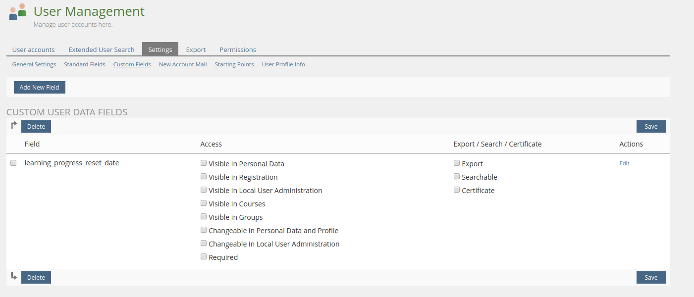
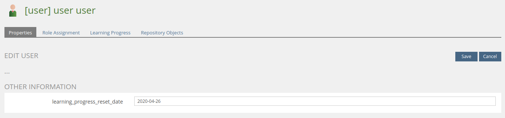

<!-- Autogenerated from composer.json - All changes will be overridden if generated again! -->

# SrLearningProgressReset ILIAS Plugin

Auto reset learning process

This is an OpenSource project by studer + raimann ag, CH-Burgdorf (https://studer-raimann.ch)

This project is licensed under the GPL-3.0-only license

## Requirements

* ILIAS 5.4.0 - 6.999
* PHP >=7.0

## Installation

Start at your ILIAS root directory

```bash
mkdir -p Customizing/global/plugins/Services/UIComponent/UserInterfaceHook
cd Customizing/global/plugins/Services/UIComponent/UserInterfaceHook
git clone https://github.com/fluxfw/SrLearningProgressReset.git SrLearningProgressReset
```

Update, activate and config the plugin in the ILIAS Plugin Administration

## Description

You need to install the [SrLearningProgressResetCron](https://github.com/studer-raimann/SrLearningProgressResetCron) plugin

Resets the learning progress of users who have reached the days

Object config:


UDF config:





## EnrolmentDateJsonServerDebug

[EnrolmentDateJsonServerDebug](../EnrolmentDateJsonServerDebug/README.md)
