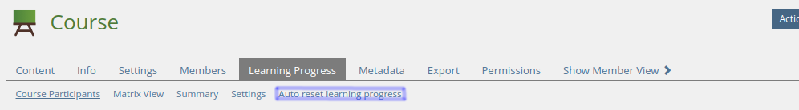
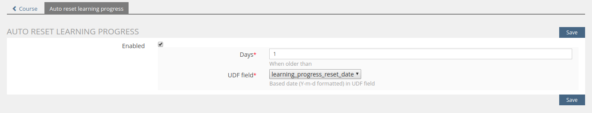
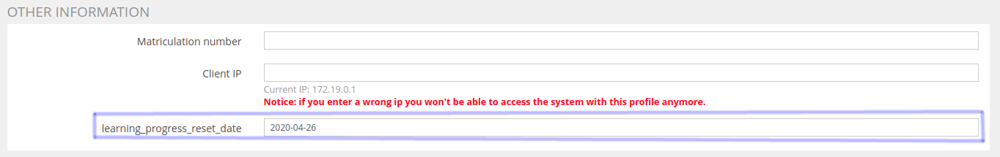

You need also to install [SrLearningProgressResetCron](https://github.com/studer-raimann/SrLearningProgressResetCron).

Resets the learning progress of users who have reached the days

Object config:

UDF config:

## EnrolmentDateJsonServerDebug
[EnrolmentDateJsonServerDebug](../EnrolmentDateJsonServerDebug/README.md)
